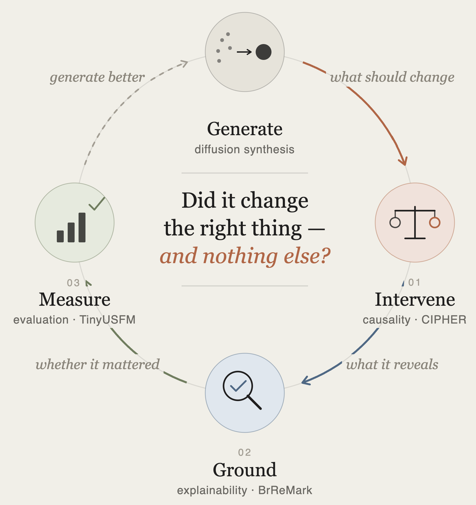
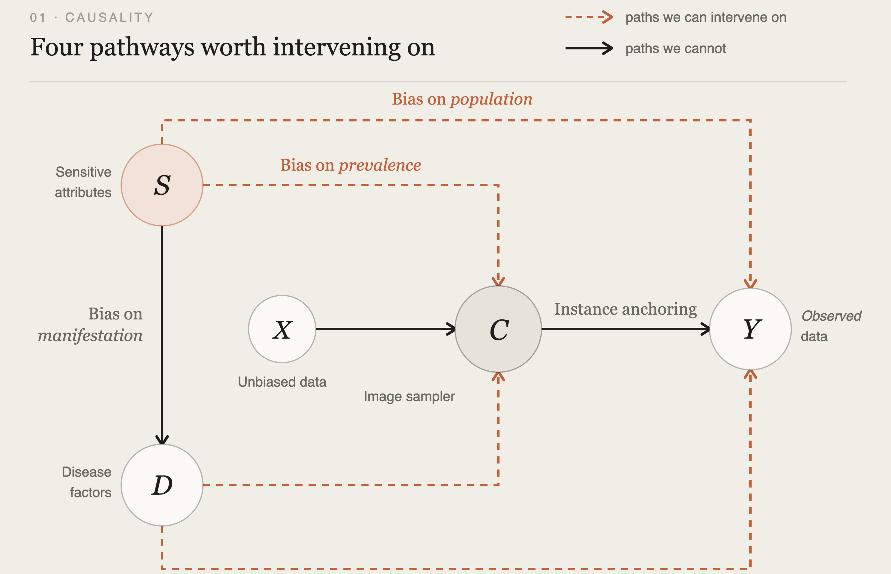
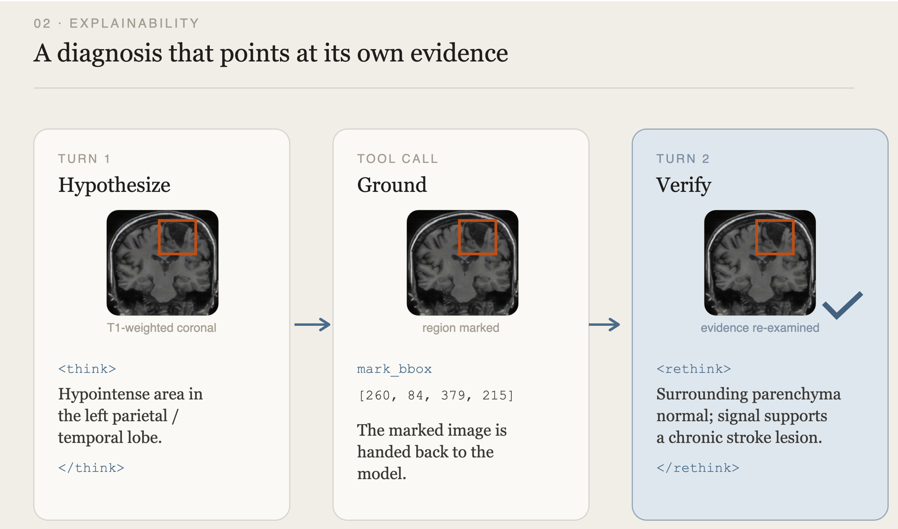

## The limits of realism

For most of the past decade, progress in medical image synthesis has been measured by how convincing the output looks — sharper textures, fewer artifacts, lower FID. This was a reasonable objective for its time. The open question was whether generative models could produce anatomically plausible images at all, and realism served as a tractable proxy for a goal the field could not yet state precisely.

That proxy has outlived its usefulness. A synthetic chest X-ray can be indistinguishable from a real one and still encode precisely the spurious correlation it was generated to remove. A reconstructed ultrasound frame can score well on every perceptual metric while the boundary a clinician needs has been quietly erased. Realism remains necessary. It has never been sufficient.

Consider two artifacts. In the first, we hand you a synthetic chest X-ray: anatomically flawless, indistinguishable from real, and free. In the second, we hand you the same image together with a statement — this is that patient's scan, with one specified factor changed, and here is what was changed and what was held fixed.

The pixels may be identical. The second artifact is far more useful, because only it supports an inference. **The value does not reside in the generated image. It resides in the relation between that image and the one it came from.**

Establishing that relation is not one problem but three, and they are asked in order. What should change. What the change reveals. Whether it mattered. Each answer constrains the next, and the third returns to the first.

<div style="text-align: center; margin: 2.5rem 0;">
  
</div>

## What should change

The first question is what "one factor changed" means operationally — and it is where much of the fairness-oriented synthesis literature runs into difficulty.

A sensitive attribute does not reach the pixels through a single controllable channel. It arrives through several simultaneously: through which patients entered the dataset, through how disease presents within a subgroup, through what the sampler was conditioned on. Intervening on one channel removes part of the dependency and leaves the remainder intact — while producing images that appear, by every available measure, to have been successfully debiased. This is the failure mode that realism cannot detect, because the resulting images are genuinely realistic.

**CIPHER** answers the question by specifying the image formation process as a structural causal model before designing any intervention. The graph exposes four distinct pathways from sensitive attributes to image content, and separates those we can act on from those we cannot.

{fig-alt="Causal graph of four pathways from sensitive attributes to image content, with CIPHER intervening on all four simultaneously"}

The intervention uses a diffusion backbone with classifier-free guidance and null-text inversion, reconstructing patient anatomy faithfully while permitting precise edits to attribute-dependent content. Across chest X-ray and dermoscopy benchmarks, intervening on all four pathways jointly reduced worst-group disparity by an average of 35.8% relative to disease-conditioned synthesis baselines — and overall diagnostic accuracy improved rather than degraded. Fairness interventions are usually discussed as a trade against average performance. These results suggest the trade is not intrinsic; it is a symptom of interventions that suppress the correlate rather than the mechanism.

But a specified intervention is a claim, not a result. Having asserted what should change, we need some way to see what the change actually did.

## What it reveals

An instrument whose output cannot be examined is not an instrument but an oracle. Most medical vision-language models are oracles in this sense: a diagnosis is produced in a single forward pass, and there is no principled way to ask which image evidence supported it. On a normal study, the fluency that makes the output readable will also describe a finding that is not present, and nothing in the output distinguishes that case from a correct one.

**BrReMark** makes the readout explicit. The model proposes a hypothesis, commits to a region via a bounding box, receives the marked image back, and only then re-examines the evidence and issues a diagnosis.

{fig-alt="BrReMark workflow: hypothesize a region, ground it with a bounding box, then verify the diagnosis against that region"}

The ordering gives the design its force. Because the region is committed before the verdict, the explanation constitutes a falsifiable claim rather than a rationalization constructed after the conclusion. This is the property post-hoc saliency lacks, and the reason it has not earned clinical trust. Detection mAP<sub>50</sub> rises from 0.74% to 37.54% over the base model, and on the NOVA out-of-distribution benchmark false positives fall by 45.7% against the prior state of the art.

Note where generation re-enters. A model learns to localize correctly only if the location was controlled during training, and domain-randomized pathology synthesis supplies exactly that: lesions whose position and extent are known by construction. The answer to the first question is what makes the second question answerable. Here the generative model is not the diagnostic system — it is what makes the diagnostic system checkable.

Yet a grounded, legible change is still not necessarily a change that matters.

## Whether it mattered

This is the question the field currently answers least well, and it is the one that determines whether the other two answers mean anything.

Ultrasound reconstruction is routinely assessed with metrics designed for natural images. PSNR and VGG-based LPIPS encode no knowledge of acoustic physics or the structural conventions of sonography, and they aggregate over precisely the localized degradation that carries clinical consequence. A metric that cannot resolve a failure mode cannot bound it.

We built two metrics on an ultrasound foundation model instead: **TinyUSFM-uLPIPS**, a full-reference perceptual distance derived from multi-layer token relations, and **TinyUSFM-NRQ**, a deployable no-reference score using clean-manifold modeling with worst-region aggregation, so localized artifacts are surfaced rather than averaged away.

{fig-alt="Scatter plots comparing metric rank against semantic damage rank for VGG-LPIPS versus TinyUSFM-uLPIPS, showing tighter agreement for the ultrasound-native metric"}

The comparison is clearest posed as a ranking problem. Order each distortion type by how much it degrades downstream clinical task performance, then order it again by each metric's severity score. A natural-image metric departs substantially from the agreement line (ρ = 0.34); the ultrasound-native metric tracks it more closely (ρ = 0.57), consistently across organs.

ρ = 0.57 is modest in absolute terms, and that is the relevant observation. If our best perceptual metrics correlate only moderately with clinical task damage, then claims of improved synthesis realism throughout the literature — our own included — rest on measurements never validated against the outcome they are meant to predict.

## The loop closes

The three questions are not a checklist. They are cyclic, and each depends on the answers to the others.

A causal intervention is unfalsifiable without measurement: the claim that a counterfactual preserved diagnostic anatomy is itself a claim about image quality, and a pixel-similarity score will readily certify a counterfactual that has removed a lesion. A grounded explanation is unlearnable without controlled synthesis: the localization supervision must originate somewhere, and observational data does not carry it. And measurement acquires value only when there are causal and interpretive claims requiring verification.

The return arc is the part most easily overlooked. A task-linked metric does not merely score a finished model — it tells you which of your interventions preserved clinical utility and which quietly destroyed it, which is precisely the signal needed to specify the next intervention better. The loop is not generate-then-check. It is generate, intervene, ground, measure, and generate again with what you learned.

## What this could unlock

If the loop closes even partially, a set of problems that are currently intractable become approachable. We think these are the ones worth naming.

**Auditing models without collecting new data.** Subgroup performance gaps are currently discovered after deployment, once enough cases accumulate. Validated counterfactual generation turns this into a pre-deployment probe: hold the pathology fixed, vary the attribute, and measure whether the prediction moves. This is a test that can be run on a model before a single patient is exposed to it.

**Supervision for pathologies that are too rare to annotate.** For most findings in radiology, the binding constraint is not model capacity but the absence of localized ground truth. Synthesis with known lesion position and extent lifts that constraint — but only if we can verify the synthesized pathology is clinically faithful rather than merely plausible, which is exactly what a task-linked metric provides.

**Acquisition and reconstruction tuned to clinical utility.** How far can an MRI acquisition be accelerated, or an ultrasound frame rate raised, before the downstream segmentation a clinician depends on degrades? Today this is answered with PSNR thresholds that correlate weakly with the thing being protected. A metric that tracks task damage converts protocol design from a perceptual judgment into a measurable trade-off.

**Harmonization with an actual criterion.** Cross-site and cross-scanner harmonization is usually validated by whether the output looks consistent. With task-linked measurement, the criterion becomes whether diagnostic performance transfers — a substantially stronger and more falsifiable standard.

**Clinically grounded stress tests.** Adversarial robustness in medical imaging has largely borrowed threat models from natural images. Counterfactual generation supports something more relevant: benchmark sets that vary scanner, protocol, demographic, and comorbidity in specified ways, so that a model's failure modes are characterized along axes that correspond to real clinical variation.

**A route toward regulatory legibility.** Approving a generative component in clinical software requires a falsifiable statement of what the model changes and what it leaves intact. "It looks realistic" cannot support that. A specified intervention, an inspectable readout, and a validated metric together can begin to.

None of these are delivered by our current results. Each of them, however, is blocked on the same three questions, which is the strongest argument we can offer for treating them as one problem.

## Open questions

We would be careful about how far the framing extends.

The generative model occupies a materially different position in each paper: the intervention itself in CIPHER, a source of supervision in BrReMark, and the object of measurement in the ultrasound work. This variation is substantive and we prefer to retain it rather than resolve it into a single account.

Nor is the loop closed. Our metrics track clinical task damage better than the alternatives but not nearly well enough to certify a system for deployment. The causal graph is a model, and the pathways we can enumerate are not demonstrably exhaustive. Grounding suppresses hallucination without eliminating it.

Realism was a scaffold, and a productive one. The substantive problem begins once it comes down and we ask what the generated image was for.

## Related Publications

```{=html}
<pre class="quarto-appendix-bibtex" data-clipboard-text="@article{jia2026cipher,
  title={CIPHER: Causal Intervention Pathways for Healthcare Equity and Robustness},
  author={Jia, Xinyu and Guo, Weidong and Zhao, Wangyuan and Guo, Yi and Li, Zeju and Wang, Yuanyuan},
  journal={arXiv preprint arXiv:2607.02596},
  year={2026}
}
@article{li2026brremark,
  title={Enhancing Brain MRI Anomaly Detection and Reasoning with ROI Rethink and Synthetic Data},
  author={Li, Shangkun and Xu, Jie and Guo, Yi and Li, Zeju and Wang, Yuanyuan},
  journal={arXiv preprint arXiv:2606.25894},
  year={2026}
}
@article{huang2026defining,
  title={Defining Robust Ultrasound Quality Metrics via an Ultrasound Foundation Model},
  author={Huang, Ziyang and Li, Bingyan and Ma, Chen and Liu, Tianyi and Zhai, Yihui and Xu, Hong and Guo, Yi and Li, Zeju and Wang, Yuanyuan},
  journal={arXiv preprint arXiv:2604.19512},
  year={2026}
}"><code>@article{jia2026cipher,
  title={CIPHER: Causal Intervention Pathways for Healthcare Equity and Robustness},
  author={Jia, Xinyu and Guo, Weidong and Zhao, Wangyuan and Guo, Yi and Li, Zeju and Wang, Yuanyuan},
  journal={arXiv preprint arXiv:2607.02596},
  year={2026}
}
@article{li2026brremark,
  title={Enhancing Brain MRI Anomaly Detection and Reasoning with ROI Rethink and Synthetic Data},
  author={Li, Shangkun and Xu, Jie and Guo, Yi and Li, Zeju and Wang, Yuanyuan},
  journal={arXiv preprint arXiv:2606.25894},
  year={2026}
}
@article{huang2026defining,
  title={Defining Robust Ultrasound Quality Metrics via an Ultrasound Foundation Model},
  author={Huang, Ziyang and Li, Bingyan and Ma, Chen and Liu, Tianyi and Zhai, Yihui and Xu, Hong and Guo, Yi and Li, Zeju and Wang, Yuanyuan},
  journal={arXiv preprint arXiv:2604.19512},
  year={2026}
}</code></pre>
```
