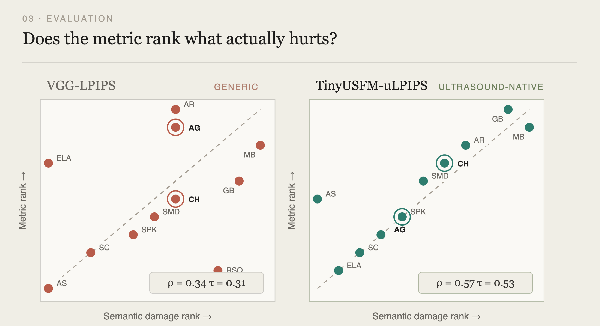

## The wrong bar

For most of the last decade, progress in medical image synthesis has been measured by how convincing the output looks. Sharper textures, fewer artifacts, better FID. That bar made sense when the open question was whether these models could produce anything anatomically plausible at all.

It is the wrong bar now. A synthetic chest X-ray can be indistinguishable from a real one and still encode the exact shortcut you were trying to remove. A reconstructed ultrasound frame can score well on every perceptual metric and still have quietly destroyed the boundary a clinician needs. Realism is necessary and nowhere near sufficient.

Underneath our three recent papers is a single question, asked of the same instrument in three different ways:

> **When a generative model changes an image, did it change the right thing — and nothing else?**

<div style="text-align: center; margin: 2.5rem 0;">
  
</div>

Each lens answers a different part of that question. Causality asks what *should* change. Explainability asks what the change *reveals*. Evaluation asks whether the change *mattered*. And the answer from the third feeds back into how the next model should generate.

## 01 · Causality — generation as intervention

Deep diagnostic models routinely show large gaps across sensitive subgroups even when average accuracy looks strong. Generative augmentation is the obvious remedy: synthesize the counterfactual, break the dependency. But most approaches edit only one of the ways a sensitive attribute leaks into image content, and quietly leave the rest of the shortcut intact.

**CIPHER** starts by writing down the image formation process as a structural causal model — and finds that sensitive attributes reach image content through *four* distinct pathways, not one. Bias on population, bias on prevalence, and two routes through disease factors. Only some of these are things we can act on; the manifestation pathway is not.

<div style="text-align: center; margin: 2.5rem 0;">
  
</div>

The intervention itself is a diffusion backbone with classifier-free guidance and null-text inversion, which lets the model reconstruct a patient's anatomy faithfully while still editing the attribute-dependent content precisely. Across chest X-ray and dermoscopy benchmarks, under both standard and shifted conditions, intervening on all four pathways at once reduced worst-group disparities by an average of **35.8%** against disease-conditioned synthesis baselines — while overall diagnostic accuracy went *up*, not down.

The generative model here is not a data augmenter. It is the operator that performs the intervention. That reframing is the contribution.

## 02 · Explainability — generation as supervision

A medical vision-language model that outputs a diagnosis in one pass gives you nothing to check. You cannot tell which region drove the conclusion, and on a normal scan the model may confidently describe a finding that isn't there.

**BrReMark** makes the region an explicit, committed part of the process. The model proposes a hypothesis, grounds it with a bounding box, receives the marked image back, and only then re-examines the evidence and commits to a diagnosis.

<div style="text-align: center; margin: 2.5rem 0;">
  
</div>

The ordering is what matters. Because the region is named *before* the verdict, the explanation is falsifiable rather than decorative. Training combines supervised fine-tuning on structured reasoning trajectories with reinforcement learning under a composite reward over both localization accuracy and reasoning quality — and, critically, a domain-randomized pathology synthesis strategy that generates lesions whose location and extent are known by construction.

That last piece is where generation re-enters. You can only teach a model to point at the right region if you controlled what was placed there. Real data cannot give you that supervision at scale; synthesis can.

The effect is large. Detection mAP<sub>50</sub> rises from 0.74% to **37.54%** over the base model, with 21.57 Clinical F1 and 45.26% diagnostic accuracy. On the NOVA out-of-distribution benchmark, false positives drop **45.7%** against the prior state of the art — evidence that grounding suppresses hallucination on pathologies the model has never seen, not merely on the training distribution.

## 03 · Evaluation — generation as the object of study

Suppose the intervention was causally sound and the explanation was properly grounded. We still need to say whether the resulting image is good enough to act on. For ultrasound this is genuinely hard: PSNR and VGG-based LPIPS were built for natural images, and they know nothing about acoustic physics or the structural conventions of sonography.

We built two metrics on top of an ultrasound foundation model. **TinyUSFM-uLPIPS** is a full-reference perceptual distance derived from multi-layer token relations. **TinyUSFM-NRQ** is a deployable no-reference score that uses clean-manifold modeling with worst-region aggregation, so localized artifacts are caught rather than averaged away.

<div style="text-align: center; margin: 2.5rem 0;">
  
</div>

The clearest result is a ranking result. Order every distortion type by how much it actually degrades downstream task performance, then order it again by what each metric says. A metric trained on natural images drifts badly off that agreement line (ρ = 0.34). An ultrasound-native metric stays close to it (ρ = 0.57), tracking Dice-score drops where VGG-LPIPS does not — and staying consistent across organs, which makes cross-site comparison meaningful for the first time.

## Why the three need each other

It is tempting to file these as three separate contributions to three separate literatures. They are not separable, and the dependencies run in both directions.

**Causal intervention requires evaluation.** "The counterfactual preserved the anatomy" is a claim about image quality. Without a task-linked metric it is unfalsifiable — and a pixel-similarity score will happily bless a counterfactual that quietly erased a lesion.

**Grounded explanation requires causal synthesis.** A model learns to point at the right region only when someone controlled what was placed there. Synthesis with known ground truth is what makes the grounding signal learnable.

**Evaluation is only worth doing because of the other two.** A metric earns its keep when there are causal and interpretive claims that need checking. Otherwise it is a number in a table.

One honest note on framing. The generative model plays a different role in each paper: in CIPHER it *is* the intervention; in BrReMark it supplies supervision for a diagnostic model that is not itself generative; in the ultrasound work it is the object being measured. We think that variety is the interesting part rather than something to flatten — three roles, one instrument, one question asked three ways.

None of this replaces realism. It just refuses to stop there.

## Related Publications

```{=html}
<pre class="quarto-appendix-bibtex" data-clipboard-text="@article{jia2026cipher,
  title={CIPHER: Causal Intervention Pathways for Healthcare Equity and Robustness},
  author={Jia, Xinyu and Guo, Weidong and Zhao, Wangyuan and Guo, Yi and Li, Zeju and Wang, Yuanyuan},
  journal={arXiv preprint arXiv:2607.02596},
  year={2026}
}
@article{li2026brremark,
  title={Enhancing Brain MRI Anomaly Detection and Reasoning with ROI Rethink and Synthetic Data},
  author={Li, Shangkun and Xu, Jie and Guo, Yi and Li, Zeju and Wang, Yuanyuan},
  journal={arXiv preprint arXiv:2606.25894},
  year={2026}
}
@article{huang2026defining,
  title={Defining Robust Ultrasound Quality Metrics via an Ultrasound Foundation Model},
  author={Huang, Ziyang and Li, Bingyan and Ma, Chen and Liu, Tianyi and Zhai, Yihui and Xu, Hong and Guo, Yi and Li, Zeju and Wang, Yuanyuan},
  journal={arXiv preprint arXiv:2604.19512},
  year={2026}
}"><code>@article{jia2026cipher,
  title={CIPHER: Causal Intervention Pathways for Healthcare Equity and Robustness},
  author={Jia, Xinyu and Guo, Weidong and Zhao, Wangyuan and Guo, Yi and Li, Zeju and Wang, Yuanyuan},
  journal={arXiv preprint arXiv:2607.02596},
  year={2026}
}
@article{li2026brremark,
  title={Enhancing Brain MRI Anomaly Detection and Reasoning with ROI Rethink and Synthetic Data},
  author={Li, Shangkun and Xu, Jie and Guo, Yi and Li, Zeju and Wang, Yuanyuan},
  journal={arXiv preprint arXiv:2606.25894},
  year={2026}
}
@article{huang2026defining,
  title={Defining Robust Ultrasound Quality Metrics via an Ultrasound Foundation Model},
  author={Huang, Ziyang and Li, Bingyan and Ma, Chen and Liu, Tianyi and Zhai, Yihui and Xu, Hong and Guo, Yi and Li, Zeju and Wang, Yuanyuan},
  journal={arXiv preprint arXiv:2604.19512},
  year={2026}
}</code></pre>
```
