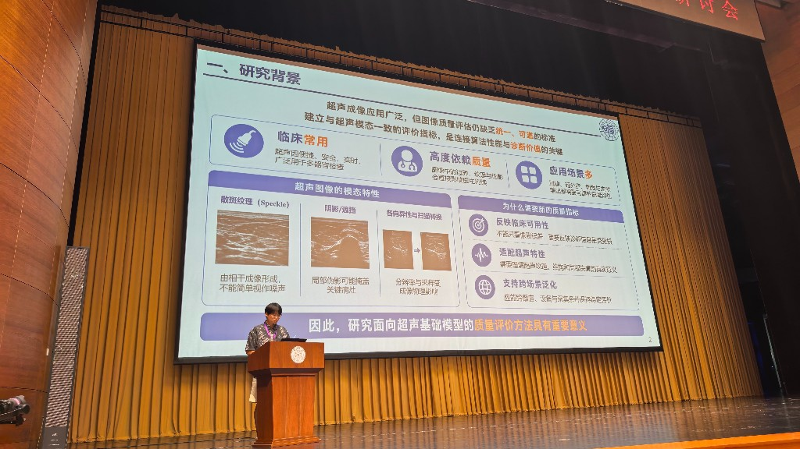

## Description

From July 10 to 12, the 13th Medical Image Computing Seminar (MICS 2026) was held at New Tsinghua Xuetang, Tsinghua University. Under the theme “Imaging Leads Biomedical Engineering, Intelligence Shapes the Future,” the meeting brought together more than **2,400** experts, young researchers, and students on site.

This year we also joined the **student research short-video presentation challenge**. MICS invited on-campus students to share their work through short videos and academic posters; **55** high-quality videos entered the preliminary round. Selection combined online engagement on the MICS Bilibili channel (**50%**) with committee scientific scores (**50%**). The top **10** advanced to an on-site final (5-minute talks), judged on scientific quality, innovation, accessibility, and production.

Our lab contributed **five** videos, all available online:

- [Temporally Coherent and Content-Controllable Colorectal Endoscopy Video Generation](https://www.bilibili.com/video/BV18GKQ6mEyG/)
- [Is This Ultrasound Image Clear Enough? Let a Foundation Model Answer](https://www.bilibili.com/video/BV1qFKQ6dEFQ/)
- [CIPHER: Causal Intervention Pathways for Healthcare Equity and Robustness](https://www.bilibili.com/video/BV1bLKQ61EXW/)
- [Enhancing Brain MRI Anomaly Detection and Reasoning with ROI Rethink and Synthetic Data](https://www.bilibili.com/video/BV1uLKQ61Es9/)
- [TinyUSFM: Towards Compact and Efficient Ultrasound Foundation Models](https://www.bilibili.com/video/BV1VMKQ6nE85/)

Among them, **Ziyang Huang** advanced to the final and won a **merit award**. Congratulations!

{fig-alt="Ziyang Huang giving an on-site presentation at the MICS 2026 student short-video challenge final"}
