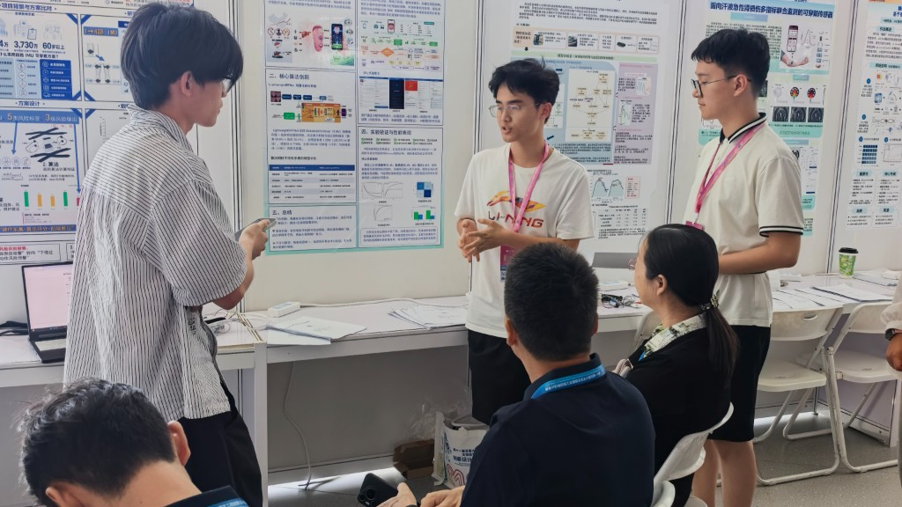
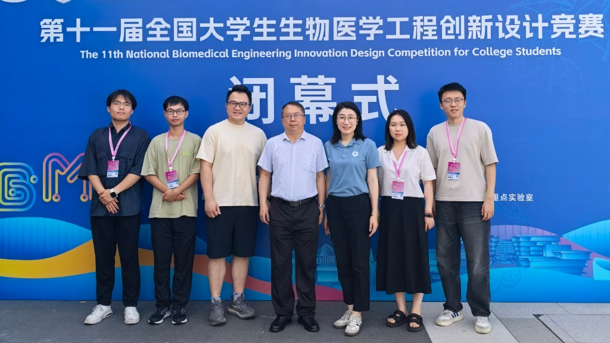

## Description

Our team attended the closing ceremony of the 11th National Biomedical Engineering Innovation Design Competition for College Students in Sanya — one of the largest national challenges in biomedical engineering in China. The competition drew about **290 universities**, with **19,474** teachers and students and **4,605** submissions. Organizers awarded roughly **5%** first prizes, **15%** second prizes, and **25%** third prizes.

We are proud that our lab contributed **four** awarded submissions:

**First prize (2)**

- EchoInsight: A Cardiac Ultrasound Agent with Eye–Hand–Mind Collaboration — project lead: Qin Wang
- Evidence-Grounded Brain Imaging: A Trustworthy, Traceable, and Evolvable Brain MRI Tumor Diagnosis Agent — project lead: Shangkun Li

**Second prize (1)**

- A Smart Wearable System for Knee Risk Warning During Stair Activities in Community-Dwelling Older Adults — project lead: Yingzhi Hu

**Third prize (1)**

- Companion Brain Imaging: A Brain MRI Generation and Progression Model for Alzheimer's Disease Course — project lead: Xinyu Jia

In particular, Yingzhi Hu's group is mainly composed of first-year undergraduates. They built a wearable system that can detect knee risk during stair activities — a practical tool for older adults. It is impressive that Year-1 students could deliver such a complete system, and we look forward to seeing what they do next.

{fig-alt="Yingzhi Hu's Year-1 undergraduate team presenting their intelligent wearable knee risk warning system to judges"}

{fig-alt="Group photo at the closing ceremony of the 11th National BME Innovation Design Competition"}
